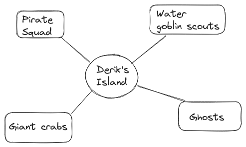

# Tag Random Tables
An algorithm to generate dynamical random tables for encounters in a TTRP game, constructing a series of weighted graphs according to tags.

## Main concept

After Knights of Last Call's live-stream on [Dynamic Random Encounters](https://www.youtube.com/watch?v=8cHfi9csAVc) I decided to develop an algorithm to generate random tables from more flexible structures than linear models. Graphs, with nodes and edges, are the more general structure to derive dynamic random tables for encounters. Each location _L_ is associated with a graph _Gl_, with a main node representing the location itself connected to all its related encounters, weighted by tags. 



The probability of an encounter is proportional to the amount of tags the encounter has in common with the given location.


```math

P(e|l) = \dfrac{O_{e_i} \times \sum_{ T_{l} \cap {T}_{e_i}} 1 }{\sum_{i} O_{e_i} \times \sum_{ T_{l} \cap {T}_{e_i}} 1}
```


where O is the _occurrence factor_ of the encounter (from common to rare) and T is the set of tags related to an encounter or location. The denominator is set in such a way that the sum of all encounters makes 1.

**A tag can be anything**, from environmental features to fronts relevant to the campaign world.

# Ingest data using Google Sheets

Because many users might not be experienced using JSON files, I created a [Google Spreadsheet](https://docs.google.com/spreadsheets/d/1zxEBxsflxflDBs4TsFfkgrI5gZ8FIyQp-RZR5M5M1fc/edit?gid=599884660#gid=599884660) that will assist the user in generating correct CSV files to be ingested in the program.

Follow these steps for a correct set of CSV files: 

1. Copy the [Google Spreadsheet](https://docs.google.com/spreadsheets/d/1zxEBxsflxflDBs4TsFfkgrI5gZ8FIyQp-RZR5M5M1fc/edit?gid=599884660#gid=599884660) template on your Google Drive, or in your local machine.

2. Populate tags, encounters and locations desired. If encounters and locations requires more tags, add a new one in a row below, as illustrated in the example.

3. Once you are done with the data, download each separate list through the File->Download .csv option.

4. Move the files in the same directory of the ``tag-random-tables-generator.py`` file and rename them as
``tag_list.csv``, ``encounters_list.csv`` and ``locations_list.csv``

5. Make a backup of your current .json files before running the code, in case something might get wrong.

# Running the code

## Prerequisites

- Python 3
- **csv** and **json** modules

There are several Python scripts with the prefix "add" that allow the user to populate locations, encounters and tags that will be added to the lists, recorded in JSON format.

The main script ``tag-random-tables-generator.py`` will generate random tables in CSV format for each location, given a day-time tag as input (such as "Night", or "Day")

Enjoy!
